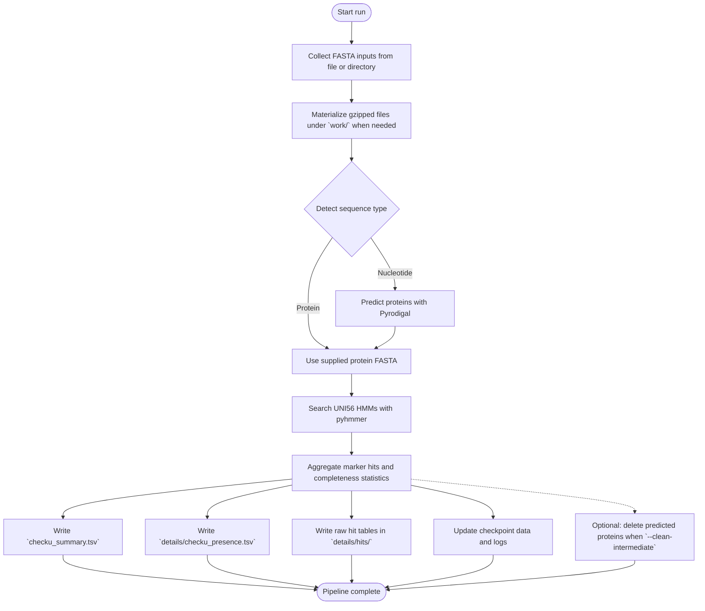

# CheckU

CheckU evaluates bacterial and archaeal genomes with the UNI56 universal single-copy marker set. The program reads amino acid FASTA files or nucleotide assemblies, calls genes with Pyrodigal when needed, and scores markers with PyHMMER. Results include completeness, contamination, and per-marker hit tables.

## Requirements

- FASTA inputs in plain or gzip form (`.faa`, `.fa`, `.fna`, and friends)

## Installation (Recommended)

Make sure you have [`Pixi`](https://pixi.prefix.dev/latest/) installed:

```bash
curl -fsSL https://pixi.sh/install.sh | sh
```

Install `CheckU` with `Pixi`:

```bash
pixi global install \
  -c conda-forge \
  -c bioconda \
  -c https://repo.prefix.dev/astrogenomics \
  checku
```

### Quick test

Small test data sets ship with `CheckU`. After installation you can confirm the pipeline by running:

```bash
checku test
```

See the **Expected Results** section below for the expected output tables.

### Alternative: pip (PyPI)

```bash
pip install checku
```

### Developer install (Pixi)

If you want to download the code and develop locally:

```bash
git clone https://github.com/juanvillada/checku
cd checku
pixi install
```

## Quick check

```bash
checku --help
```

If you are running from the repository with `Pixi`:

```bash
pixi run python -m checku --help
```

You should see the command line help without errors.

## Input rules

- Provide either a single FASTA file or a directory of FASTA files.
- Protein files are used as-is. Nucleotide files trigger Pyrodigal gene calls.
- Compressed files (`.gz`) are supported; they are unpacked into the run workspace.

## Running the pipeline

If you are running from the repository with `Pixi`, replace `checku` below with `pixi run python -m checku`.

The examples below use the bundled test data from a source checkout. Replace the
paths with your own FASTA inputs, or run `checku test` after installation.

### Pipeline overview

The diagram below shows the main stages executed by CheckU.



### Single proteome

```bash
checku run \
  checku/data/test_genomes/faa/IMGI2140918011.faa \
  --output-dir tmp/proteome_example \
  --cpus 4
```

### Directory of proteomes

```bash
checku run \
  checku/data/test_genomes/faa \
  --output-dir tmp/proteome_batch \
  --cpus 8
```

### Single assembly

```bash
checku run \
  checku/data/test_genomes/fna/IMG2140918011.fna \
  --output-dir tmp/assembly_example \
  --cpus 4 \
  --clean-intermediate
```

Use `--clean-intermediate` if you do not need the predicted protein FASTA after the run.

## Custom marker sets

- The default marker file ships with CheckU (UNI56).
- Point `--hmm` to a different GA-calibrated `.hmm` file or to a directory that holds `.hmm` or `.hmm.gz` profiles.
- Every profile must define GA cutoffs. The run stops early if a profile is missing them or if names are duplicated.

Example:

```bash
checku run \
  /path/to/genomes \
  --hmm /path/to/custom_markers.hmm \
  --output-dir tmp/custom_markers \
  --cpus 8
```

## Outputs

All outputs live in the chosen `--output-dir`.

- `checku_summary.tsv` — per-genome summary with completeness, contamination, duplicate counts, and Pyrodigal gene statistics.
- `details/checku_presence.tsv` — marker presence/absence matrix.
- `details/hits/*.tsv` — raw pyhmmer hits with domain scores.
- `checkpoint/checku_checkpoint.json` — resume data for interrupted runs.
- `logs/checku.log` — timestamps, command line, and status messages.

## Resume and logging

- Runs resume automatically when `--resume` is left on (default).
- Use `--no-resume` to start fresh; the older checkpoint is copied aside.
- Increase `--log-level` to `DEBUG` when you need extra detail.

## Verification step

Small test data sets ship with `CheckU`. After installation you can confirm the pipeline by running:

```bash
checku test
```

The command should finish without errors and produce the summary and presence tables described above.

If you are running from the repository with `Pixi`:
```bash
pixi run python -m checku test
```

### Expected results (Bundled test data)

The tables below summarize the expected `checku_summary.tsv` values for the bundled FAA and FNA test sets.
Absolute paths are omitted for privacy.

FAA (protein inputs):

| genome_id | markers_detected | completeness | duplicated_markers | contamination |
| --- | --- | --- | --- | --- |
| IMGI2140918011 | 55 | 98.21 | 0 | 0.0 |
| IMGI2645727657 | 56 | 100.0 | 0 | 0.0 |
| IMGI651324087 | 56 | 100.0 | 0 | 0.0 |
| IMGM3300027739_BIN74 | 36 | 64.29 | 0 | 0.0 |
| SCISO2808607008 | 55 | 98.21 | 1 | 1.79 |
| SDISOGCA_003484685.1 | 47 | 83.93 | 1 | 1.79 |
| SHISO2654587767 | 55 | 98.21 | 1 | 1.79 |
| SLISOGCF_900639865.1 | 56 | 100.0 | 1 | 1.79 |
| SRISO640427127 | 52 | 92.86 | 0 | 0.0 |
| SXGCA_000019745.1 | 55 | 98.21 | 0 | 0.0 |
| SXGCA_902860225.1_Azoamicus_ciliaticola | 51 | 91.07 | 0 | 0.0 |
| SXISO642555114 | 54 | 96.43 | 1 | 1.79 |

FNA (nucleotide inputs with Pyrodigal):

| genome_id | markers_detected | completeness | duplicated_markers | contamination | pyrodigal_genes | pyrodigal_contigs |
| --- | --- | --- | --- | --- | --- | --- |
| IMG2140918011 | 56 | 100.0 | 0 | 0.0 | 2974 | 78 |
| IMG2645727657 | 56 | 100.0 | 0 | 0.0 | 1516 | 1 |
| IMG2645727657_HALF | 46 | 82.14 | 0 | 0.0 | 821 | 1 |
| IMG651324087 | 56 | 100.0 | 0 | 0.0 | 2572 | 73 |
